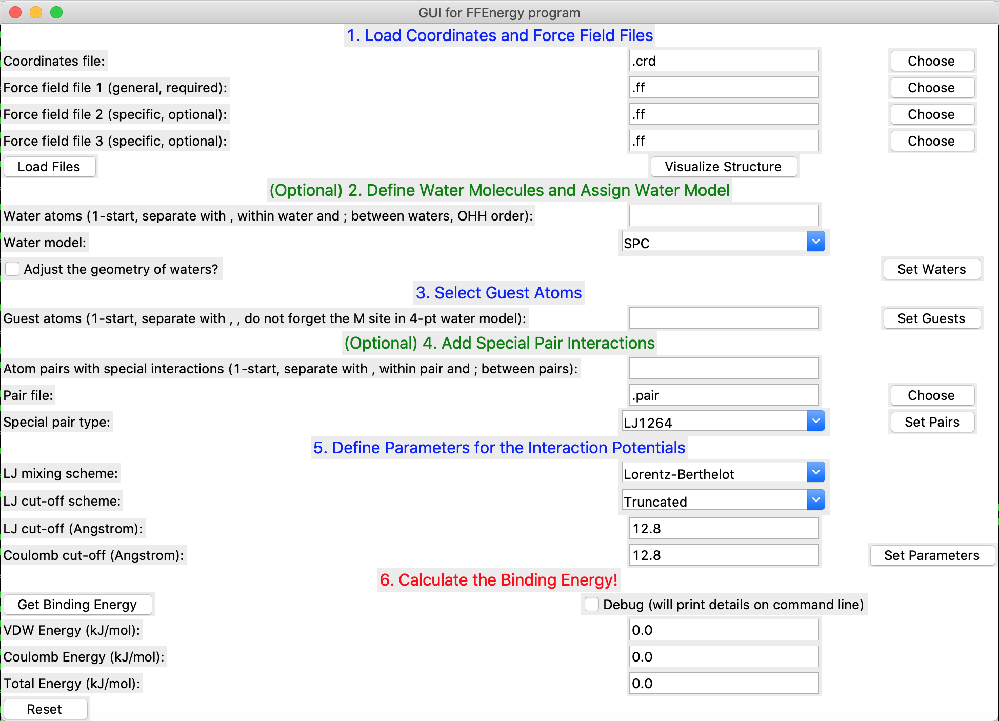

# FFEnergy

Light-weight calculator (with GUI available) of binding energy in host-guest complexes using force fields and electrostatics.

By Haoyuan Chen

## Quick start (GUI)

1. Make a .crd file of your system (super easy, see below).
2. Open `GUI.py`, simply go from top to bottom, click corresponding "Load" or "Set" buttons after finishing each section, then calculate the binding energy in the last section.

## Quick start (script)

1. Make a .crd file of your system (super easy, see below).
2. Run `WaterModelAssign.py` if you have water molecules in your system that you want to describe using a standard water model (see the examples).
3. Run `FFEnergy.py` to calculate the binding energy (see the examples).

## Format of .crd file

Each line in .crd file looks like: **AtomName  X  Y  Z  PartialCharge**. For example:   
**Zr    1.364   1.433   1.676    1.603481**   
The partial charge can be obtained from QM calculations (put 0.0 if you do not have it). Another example:   
**O\_roh    2.609   3.045   1.190   -0.802568**   
Here, the atom name O\_roh contains more information than just the chemical element. It refers to an O atom with the roh type, which is defined in `TraPPEUA.ff`.   
If you have water molecules that need to be described using standard water models, then the partial charge of those atoms will be overwritten after running `WaterModelAssign.py` anyway. The script (or the 'Set Waters' button in the GUI) will also create a new .crd file with the name of the water model specified.

## Example 1: Binding energy between a Mg2+ ion and a water molecule

See `examples/Mg_water_binding`

## Example 2: Binding energy of a water molecule on a MOF node

See `examples/water_MOF_binding`

## Features

- All parameters are in light-weight and human-readable plain text formats, easy to view and edit (see `0NOTES.txt`).
- Available force fields: UFF, AMBER-ff99SB, TraPPE-UA.
- Available water models: SPC, SPC/E, TIP3P, TIP4P, TIP4P-Ew.
- Available special pair potentials: 12-6-4 LJ, Morse.
- Can adjust the geometry of defined water molecules to be the same as defined in water models, which can come handy in comparing energies.
- Can visualize the structure in the GUI (requires [ase](https://wiki.fysik.dtu.dk/ase/)).

## To-do

- Potential energy scan along 'reaction coordinates'.

## Notes 

1. The special potential (.pair file) will override the default 12-6 LJ (but not Coulomb) potential for selected atom pairs.
2. When reading multiple force fields (.ff files), if same atom names are used in multiple files, the parameters in the last file will override the previous ones.
3. Cr, Fe and Ce have different 12-6-4 parameters for different oxidation states.
4. When using 4-point water models, remember to also include the additional dummy atom as a guest atom.
